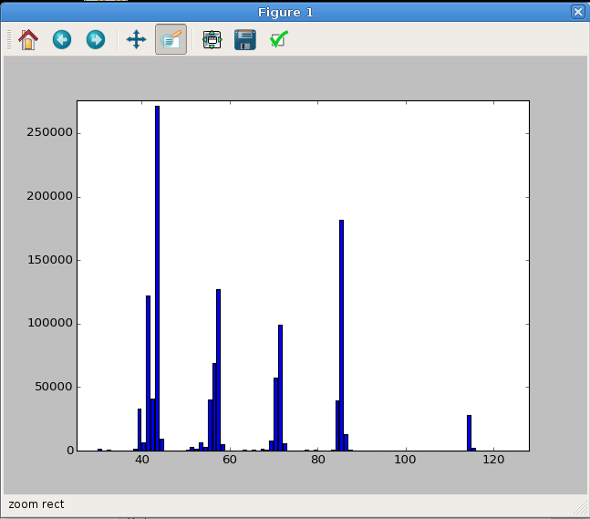
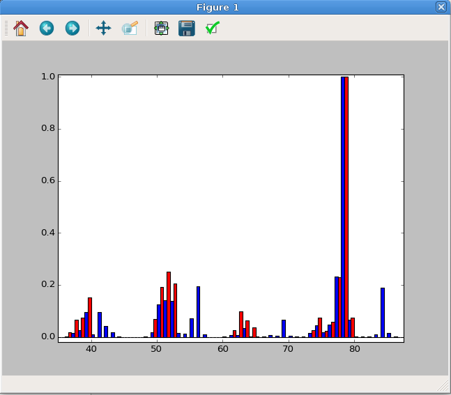
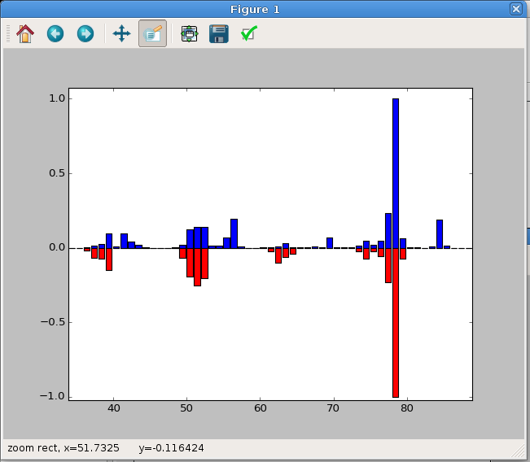
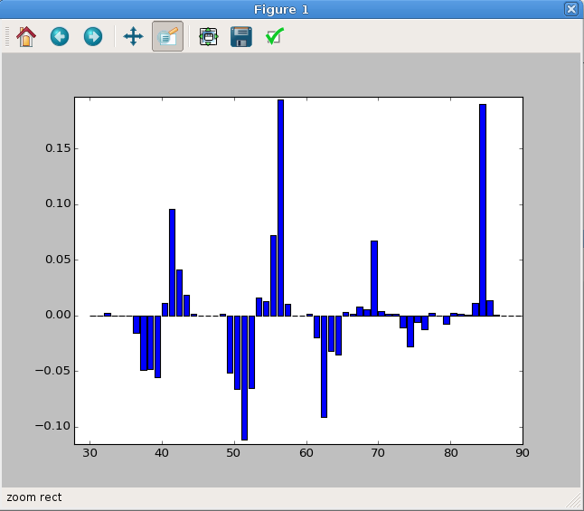
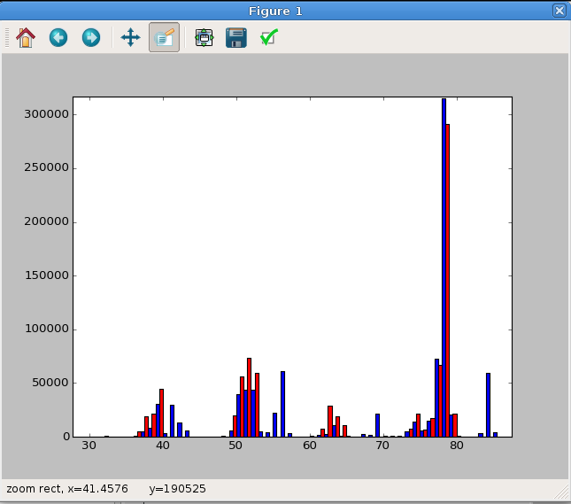
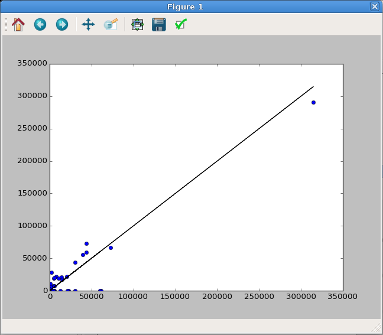
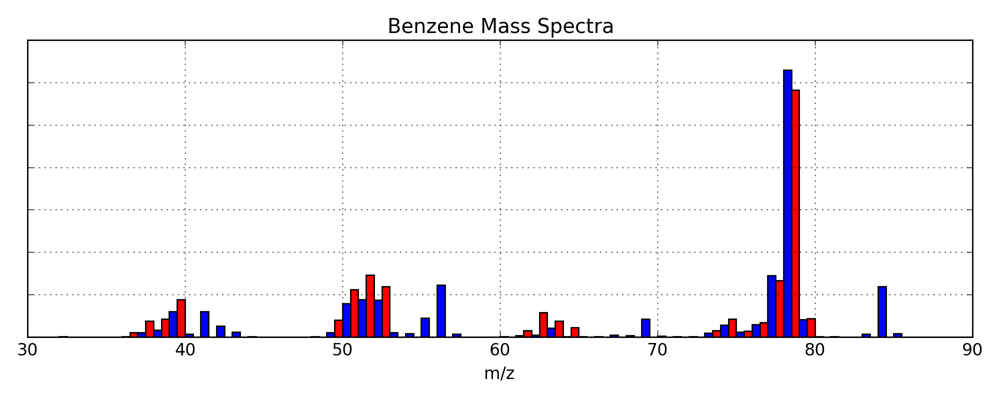

Appendix B
##########

This appendix contains some examples of common usage scenarios. In some cases,
the code will be presented as it would be written in a Python program file.
These can also be run from the IPython interpreter by using ``%run`` or by
individually typing each line. See the :ref:`IPython instructions <ipython>`
for more information. Little explanation is provided here. See the
documentation for detailed descriptions of the *gcmstools* objects or any
third-party packages.

Full Manual Processing Example
------------------------------

Below is an example script that does a complete analysis starting from loading
the files all the way through running a calibration and extracting
concentrations. This is approximately equivalent to what the function
``data_proc`` is doing (see :doc:`autoint` for that function).

This program is saved in the sample data folder under the name
"full_manual.py".

.. literalinclude:: ../sampledata/full_manual.py
    :linenos: 

A couple of notes. ``os.listdir`` is simply returning a list of all the files
that are contained in the folder defined by ``datafolder``
("folderwithdata/").

Because that folder may have many different types of files, we need to do some
filtering. ``cdfs`` uses Python's list comprehension to build up a list of
filenames that end with "CDF". It also appends the ``datafolder`` path to the
beginning of the file name. This list comprehension syntax is a very compact
and efficient way to represent the following loop structure::
    
    # The following for loop is equivalent to 
    # cdfs = [os.path.join(datafolder, f) for f in files if f.endswith('CDF')] 
    cdfs = []
    for f in files:
        if f.endswith('CDF'):
            path_plus_name = os.path.join(datafolder, f)
            cdfs.append(path_plus_name)

Extracting Calibration Tables to Excel
--------------------------------------

It may be cumbersome to view calibration and concentration data directly from
the HDF file. You can save any of the tables in the HDF file to an Excel
format using `Pandas' to_excel function`_ which is part of each DataFrame.

.. code-block:: python

    from gcmstools.datastore import HDFStore

    h5 = HDFStore('data.h5')
    h5.pdh5.datacal.to_excel('datacal.xlsx',)
    h5.close()

Keep in mind that these Excel files are not tied in any way to the original
HDF file. If you change the calibration information or add new data, you'll
have to regenerate this file to see the new data.

.. _Pandas' to_excel function: http://pandas.pydata.org/pandas-docs
        /dev/generated/pandas.DataFrame.to_excel.html

Plotting a Mass Spectrum
------------------------

You may want to be able to plot a mass spectrum from a GCMS file. This is
fairly straightforward, but requires a few steps.

*Step 1*

First read in your file. This can be done directly::

    In : from gcmstools.filetypes import AiaFile

    In : data = AiaFile('datasample1.CDF')
    Building: datasample1.CDF'

Or by reading out a data file from a HDF storage file::

    In : from gcmstools.datastore import HDFStore

    In : h5 = HDFStore('data.h5')

    In : data = h5.extract_gcms_data('datasample1')

*Step 2: Optional*

Plot the total ion chromatogram to find the elution time for the peak of
interest. This is only necessary if you don't already know the time.

.. code::

    In : import matplotlib.pyplot as plt

    In : plt.plot(data.times, data.tic)
    Out :
    [<matplotlib.lines.Line2D at 0x7f34>]

    In: plt.show()

Hover the mouse over the peak you want. Somewhere at the bottom on the window,
it should display the x and y coordinates of the cursor. Note the x number,
and close the plot window. You don't need to know the number to every last
digit of precision -- a rough approximation will probably get you close.

*Step 3*

Now you can find the array index that corresponds to that time. All GCMS file
objects define an ``index`` function to help you with this. The first argument
of the index function is the array to index. After that you can put one or
more numbers. For a single input number, a single index will be returned. For
several values, a list of indices will be returned. In "datasample1.CDF",
octane elutes at approximately 7.16 minutes.

.. code::

    In : idx = data.index(data.times, 7.16)

    In : idx
    Out: 1311

*Step 4*

Now we are ready to plot the data. The ``GmsFile.intensity`` attribute is a 2D
array of all the measured MS intensities at every time point. Its shape is
(number of time points, number of masses). We can use our time index to select
a certain time. We'll make this a box plot, which is more typical for this
type of data. (You only need to import Matplotlib if you haven't done it
before.)

.. code:: 

    In : import matplotlib.pyplot as plt

    In : plt.bar(data.masses, data.intensity[idx])
    Out: <Container object of 462 artists>

    In : plt.show()

You should see something like the plot in :num:`Figure #singlems`.

.. _singlems:

    The MS of octane plotted from our sample data set. In this case, the plot
    was zoomed in a bit to highlight the relevant data region. Your initial
    plot may look different.

Plotting Data and Reference MS
------------------------------

Let's say you want to compare the reference MS with your data set. This can be
done in much the same manner as before but with a couple of extra steps. We'll
use 'benzene' as our reference compound of choice.

*Step 1*

Get your *referenced* MS data.

.. code::

    In : from gcmstools.filetypes import AiaFile
    
    In : from gcmstools.reference import TxtReference

    In : data = AiaFile('datasample1.CDF')
    Building: datasample1.CDF'

    In : ref = TxtReference('ref_specs.txt')

    In : ref(data)
    Referencing: datasample1.CDF

Or from the HDF file.

.. code::

    In : from gcmstools.datastore import HDFStore

    In : h5 = HDFStore('data.h5')

    In : data = h5.extract_gcms_data('datasample1.CDF')

*Step 2* 

Get the time index as shown above. Benzene elutes at 3.07 minutes.

.. code::

    In : idx = data.index(data.times, 3.07) 

    In : idx
    Out: 553

You'll also need an index for the reference compound.

.. code::

    In : refidx = data.ref_cpds.index('benzene')

    In : refidx
    Out: 0
   
*Step 3* 

The reference MS are stored in the ``ref_array`` variable. This is also a 2D
numerical array with the shape of (number of ref compounds, number of masses),
so indices can be selected in the same manner as before. However, these data
are normalized, and the sample data will be much larger. We can easily
normalize the data spectrum.

.. code::

    In : normdata = data.intensity[idx]/data.intensity[idx].max()

Import Matplotlib for plotting before doing anything else.

.. code::

    In : import matplotlib.pyplot as plt

Side-by-Side Plot
+++++++++++++++++

Here we'll do a side-by-side plot. By default, each bar will take up all of
the space between each x-axis point (1.0 in this case), so we need to make the
bars narrower otherwise the second bar plot will overlap. In addition, the
x-axis for the second data set must be adjusted so the bars start at slightly
adjusted positions. We'll also change the face color ("fc") otherwise they
will be the same for both. In this case, we'll use the same adjustment as the
width of the bars. The resulting plot is show in :num:`Figure #sidebyside`.

.. code::

    In : plt.bar(data.masses, normdata, width=0.5, fc='b')
    Out: <Container object of 462 artists>

    In : plt.bar(data.masses+0.5, data.ref_array[refidx], width=0.5, fc='r')
    Out: <Container object of 462 artists>

    In : plt.show()

.. _sidebyside:

    A side-by-side MS plot. This has been zoomed in to highlight the important
    data region.

Up-Down Plot
++++++++++++

As an alternative, you could plot one of the data sets upside down, which may
have some utility. Notice, we just need to invert (``-``) one of the intensity
data sets. The resulting plot is shown in :num:`Figure #updownms`.

.. code::

    In : plt.bar(data.masses, normdata, fc='b')
    Out: <Container object of 462 artists>

    In : plt.bar(data.masses+0.5, -data.ref_array[refidx], fc='r')
    Out: <Container object of 462 artists>

    In : plt.show()

.. _updownms:

    A Up-Down MS plot. This has been zoomed in to highlight the important
    data region.

Difference Plot
+++++++++++++++

To plot the difference between the data and the reference, here's the plotting
command. Notice that we are just subtracting one spectrum form the other. The
resulting plot is shown in :num:`Figure #diffms`.

.. code::

    In : diff = normdata - data.ref_array[refidx]

    In : plt.bar(data.masses, diff)
    Out: <Container object of 462 artists>

    In : plt.show()

.. _diffms:

    A difference mass spectrum plot. This has been zoomed in to highlight the
    important data region.

Plotting Data and Fitted MS
---------------------------

You may want to plot a mass spectrum relative to the fitted spectrum for one
particular reference compound. This can be done in a very similar manner as
above, but we must first fit our data. This will follow the side-by-side
reference plotting section, check there to find out how to set some of these
variables.  Again, we'll use 'benzene' as our test case.

.. code::

    In : from gcmstools.fitting import Nnls

    In : fit = Nnls()

    In : fit(data)
    Fitting: datasample1.CDF

Bar Plot
++++++++

In this case, we need to do a little Numpy index magic. Remember that the
fitting generate a ``fit`` array. These are the least-squares coefficients at
every data point. This is a 2D array with shape (# of time points, # of
reference compounds). We will use our time index (``idx``) and our reference
index (``refidx``) to select out one least-squares coefficient and then
multiply this by our reference mass spectrum. The final plot window is shown
in :num:`Figure #fitms`.

.. code::

    In : fitspec = data.fits[idx, refidx]*data.ref_array[refidx]

    In : plt.bar(data.masses, data.intensity[idx], width=0.5, fc='b')
    Out: <Container object of 462 artists>

    In : plt.bar(data.masses+0.5, fitspec, width=0.5, fc='r')
    Out: <Container object of 462 artists>

    In : plt.show()

.. _fitms:

    A side-by-side MS plot of the sample data versus the fitted data for
    benzene. This has been zoomed in to highlight the important data region.

Dot Plot
++++++++

Alternatively, this comparison can be done with a standard plot, as long as
the markers are set to be large dots (``'o'``). A perfect correlation would be
a straight line. We can show this by plotting the sample data against itself
as a solid black line (``'k-'``). This plot window is shown in :num:`Figure
#dotplot`.

.. code::

    In : fitspec = data.fits[idx, refidx]*data.ref_array[refidx]

    In : plt.plot(data.intensity[idx], fitspec, 'o')
    [<matplotlib.lines.Line2D at 0x7f34>]

    In : plt.plot(data.intensity[idx], data.intensity[idx], 'k-')
    [<matplotlib.lines.Line2D at 0x7f34>]

    In : plt.show()

.. _dotplot:

    A dot plot comparing the sample data versus the fitted data for benzene. A
    perfectly straight line (black) indicates a perfect fit. 

Fancy Data Versus Fit MS Plot
+++++++++++++++++++++++++++++

This example will be very similar to the Data vs Fit plots above; however, we
will use a fully process HDF storage file to get our data set.  This will be
presented as a complete script. A copy of which, called "fancy\_ms.py", is
contained in the sample data folder along with a copy of the PDF output
("fancy\_plot.pdf").  A picture of the resulting plot is shown in :num:`Figure
#fancyms`. 

.. literalinclude:: ../sampledata/fancy_ms.py
    :linenos: 

.. _fancyms:

    A fancy plot comparing the sample data (blue) and the fitted data (red)
    for benzene.  The PDF version is a vector graphic, so it has unlimited
    resolution.

