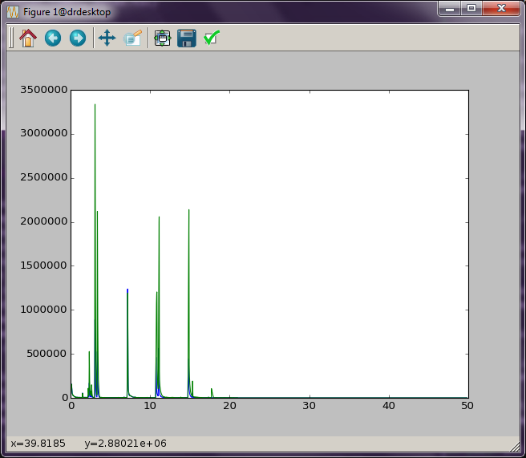

Basics of working with GCMS data files
######################################

Export the data
---------------

First of all, be sure to export your GCMS data in a common data format, such
as `AIA, ANDI, or CDF.`_ It turns out that all of these formats `are related`_
in that they are all based off of Network Common Data Format (`netCDF`_), so
they may have the file extension "AIA" or "CDF". This file type may not be the
default for your instrument, so consult the documentation for your GCMS
software to determine how to export your data in these formats. 

.. _AIA, ANDI, or CDF.: http://en.wikipedia.org/wiki/Mass_spectrometry_data_format#ANDI-MS_or_netCDF
.. _are related: https://www.unidata.ucar.edu/support/help/MailArchives/netcdf/msg05748.html
.. _netCDF: http://en.wikipedia.org/wiki/NetCDF
  

Set up the processing environment
---------------------------------

In order to process these files, run IPython from a terminal (command prompt
in Windows) in the folder containing the "gcms.py" file (which is the base
folder for this repository).  There are (at least) two ways to do this that
involve the command ``cd`` (change directory) run from either the terminal or
an IPython session. For example (``home>$`` is the command prompt located in
the folder "home", ``In:`` is the IPython prompt):

.. code::

    home>$ ipython
    In: %cd "path-to-gcms-folder"
    Out: path-to-gcms-folder
    In:

or:

.. code::

    home>$ cd path-to-gcms-folder
    gcms>$ ipython
    In:

The "*path-to-gcms-folder*" is a valid path to the folder with "gcms.py". It
can take a little practice, but this gets easier very quickly. I'll assume you
use the second form of this as it makes using the `IPython notebook`_ much
easier later.

.. _IPython notebook: http://ipython.org/notebook.html

Read AIA data files
-------------------

First of all, you will need to ``import`` the "gcms.py" file to make the code
accessible to the IPython environment. This file contains a class called
``AIAFile`` that reads and processes the GCMS files. AIAFile takes one
argument, which is a string with the file name. This string must have the path
(i.e.  folder) information if the file is not in the same directory as
"gcms.py".  Sample data files are contained in a folder called "data". 

.. code::

    In: import gcms
    In: data = gcms.AIAFile('data/datasample1.CDF')

The variable ``data`` now contains our processed GCMS data set. You can see
its contents using tab completion in IPython (``<tab>`` refers to the tab
key).

.. code::

    In: data.<tab>
    data.filename data.intensity data.nnls data.ref_build data.times
    data.integrate data.masses data.tic

All of these attributes are either data that describe or functions that modify
(methods) our dataset. You can inspect these attributes very easily in
IPython by just typing the name at the prompt.

.. code::

    In: data.times
    Out: 
    array([0.08786667, ..., 49.8351])
    In: data.tic
    Out:
    array([158521., ..., 0.])

This is a short description of these initial attributes:

* *filename*: This is the name of the file that you imported.

* *times*: A Numpy array of the times that each MS was collected.

* *tic*: A Numpy array of the total ion chromatogram intensities.

* *masses*: A Numpy array the masses that cover the data collected by the MS.

* *intensity*: This is the 2D Numpy array of raw MS intensity data. The
  columns correspond to the masses in the ``masses`` array and the rows
  correspond to the times in the ``times`` array. 

The remaining attributes *ref_build*, *nnls*, and *integrate* are functions
that deal with the non-negative fitting routine and are covered in later
sections. 

Simple plotting
---------------

We can easily plot these data using the plotting package Matplotlib. As an
example, let's try plotting the total ion chromatogram. In this case,
``data.times`` will be our "x-axis" data, and ``data.tic`` will be our "y-axis"
data.

.. code:: 

    In: import matplotlib.pyplot as plt
    In: plt.plot(data.times, data.tic)
    Out:
    [<matplotlib.lines.Line2D at 0x7f34>]
    In: plt.show()

This should produce a pop-up window with an interactive plot, :num:`Figure
#ticplot`.  (This should process should be fairly quick. However, sometimes
the plot initially appears behind the other windows, which makes it seem like
things are stuck. Be sure to scroll through your windows to find it.)

.. _ticplot:

.. figure:: _static/images/tic.png
    :width: 3.5in
    
    Total ion chromatogram.

One drawback here is that you have to type these commands every time you want
to see this plot. There is another alternative, though. You can also put all
of these commands into a text file and run it with Python directly. Copy the
following code into a plain text file called "tic\_plot.py". 

**NOTE**: it is very important that you are using a plain text file and not a
word processing (MS Word) document. On Mac/Linux, the ".py" suffix is not
required; however, in Windows, this suffix can be important. Unfortunately,
Windows hides file extentions by default, so you may have to search the web to
determine how to enable display of file extensions. Otherwise, you might end
up with a file called "tic\_plot.py.txt", which can work, but will most likely
cause confusion and annoyance. Anaconda ships with Spyder, a Python
development editor, which will take care of all of this for you, so you might
want to familiarize yourself with that program.

.. code::

    import matplotlib.pyplot as plt
    import gcms

    data = gcms.AIAFile('data/datasample1.CDF')
    plt.plot(data.times, data.tic)
    plt.show()

It is common practice to do all imports at the top of a Python program. That
way it is clear exactly what code is being brought into play. Run this new
file using the ``python`` command from the terminal.

.. code:: 

    gcms>$ python tic_plot.py

The window with your plot will now appear. (You will not be able to work in the
terminal until you close this window.) Alternatively, you can run this program
directly from IPython.

.. code::

    gcms>$ ipython
    In: %run tic_plot.py

This also pops open a new window containing the interactive plot. It has the
advantage, however, that once the window is closed, you are dropped back into
an IPython session that "remembers" all of the variables and imports that you
created in your program file. In our example above, once the plot window is
closed, your IPython session will have ``gcms``, ``plt``, and ``data`` (our
GCMS AIA file) available.  This is very useful if you want to continue to work
interactively with your data, and it is a great way to remove a bunch of
repetitive typing.

Working with multiple data sets
-------------------------------

In the example above, we opened our dataset into a variable called ``data`` in
order to be able to plot the TIC. If you want to manipulate more than one data
set, the procedure is exactly the same, except that you will need to use
different variable names for your other data sets. 

.. code::

    In: data2 = gcms.AIAFile('data/datasample2.CDF')

These two data sets can be plot together on the same figure by doing the
following:

.. code::

    In: plt.plot(data.times, data.tic)
    Out:
    [<matplotlib.lines.Line2D at 0x7f34>]
    In: plt.plot(data2.times, data2.tic)
    Out:
    [<matplotlib.lines.Line2D at 0x02e3>]
    In: plt.show()

The window shown in :num:`Figure #twotic` should appear on the screen. (There
is a blue and green line here that are a little hard to see in this picture.
Zoom in on the plot to see the differences.)

.. _twotic:

    
    Two tic plotted together

