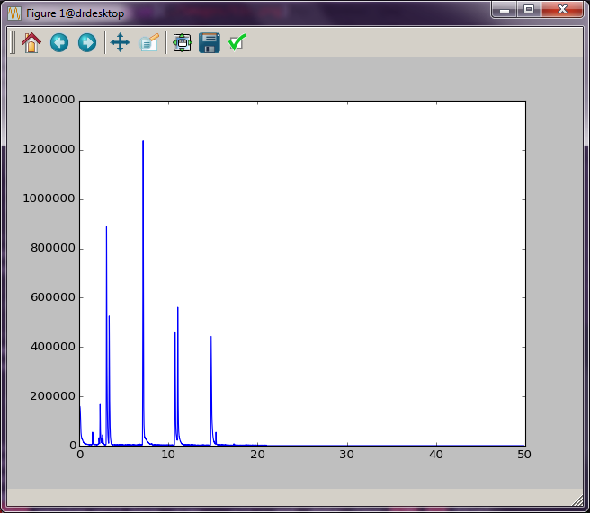

.. _basics:

Basics of working with GCMS data files
######################################

Set up the processing environment
---------------------------------

In these examples, we will run *gcmstools* form a :ref:`terminal IPython
<ipython>` session in a folder "gcms", which is located in your home
directory.

.. code::

    home>$ cd gcms

    gcms>$ ipython
    Python 2.7.9 (default, Oct 10 2014, 15:29:52)
    Type "copyright", "credits" or "license" for more information.
    
    IPython 2.3.1 -- An enhanced Interactive Python.
    ?         -> Introduction and overview of IPython's features.
    %quickref -> Quick reference.
    help      -> Python's own help system.
    object?   -> Details about 'object', use 'object??' for extra details.
    
    In : 

Some example files are provided with the *gcmstools* installation. These files
can be moved into the current directory using the ``get_sample_data``
function.

.. code::

    In : from gcmstools.general import get_sample_data

    In : get_sample_data()

The invocation above copies all of the example files to the current directory.
Individual file names can be passed to this function, if you only want a few
data files.

.. code::

    In : get_sample_data('datasample1.CDF')

Note on Conventions
-------------------

There are potentially many types of GCMS files. However, all importing objects
discussed in this section should have identical properties. This is important
for later sections of the documentation, because fitting routines, etc.
usually do not require a specific file type importer. All of the import
objects are constructed with a single string input, which is the name of the
file to process. This file name string can also contain path information, if
the file is not located in the current directory.

AIA Files
---------

Export the data
+++++++++++++++

`AIA, ANDI, or CDF`_ are all related types of standard GCMS files that are all
`derived from`_ the Network Common Data Format (`netCDF`_). They may have
the file extension "AIA" or "CDF". This file type may not be the default for
your instrument, so consult the documentation for your GCMS software to
determine how to export your data in these formats. 

.. _AIA, ANDI, or CDF: http://en.wikipedia.org/wiki/
    Mass_spectrometry_data_format#ANDI-MS_or_netCDF
.. _derived from: https://www.unidata.ucar.edu/support/
    help/MailArchives/netcdf/msg05748.html
.. _netCDF: http://en.wikipedia.org/wiki/NetCDF
  

Read AIA data files
+++++++++++++++++++

First of all, you will need to import the AIA file reader ``AiaFile`` from
``gcmstools.filetypes`` module. To read a file, you can create a new instance
of this object with a filename given as a string. 

.. code::

    In : from gcmstools.filetype import AiaFile

    In : data = AiaFile('datasample1.CDF')

The variable ``data`` now contains our processed GCMS data set. You can see
its contents using :ref:`tab completion <ipytab>` in IPython.

.. code::

    In: data.<tab>
    data.filename data.intensity data.tic
    data.index data.masses data.times

Most of these attributes are data that describe our dataset. You can inspect
these attributes very easily in IPython by just typing the name at the prompt.

.. code::

    In : data.times
    Out: 
    array([0.08786667, ..., 49.8351])

    In : data.tic
    Out:
    array([158521., ..., 0.])

This is a short description of these initial attributes:

* *filename*: This is the name of the file that you imported.

* *times*: A Numpy array of the times that each MS was collected.

* *tic*: A Numpy array of the total ion chromatogram intensities.

* *masses*: A Numpy array the masses that cover the data collected by the MS.

* *intensity*: This is the 2D Numpy array of raw MS intensity data. The
  columns correspond to the masses in the ``masses`` array and the rows
  correspond to the times in the ``times`` array. 

The *index* method is used for finding the indices from an array. Its usage is
described later.

Simple plotting
---------------

Now that we've opened a GCMS data set. We can easily visualize these data
using the plotting package Matplotlib. As an example, let's try plotting the
total ion chromatogram. In this case, ``data.times`` will be our "x-axis"
data, and ``data.tic`` will be our "y-axis" data.

.. code:: 

    In : import matplotlib.pyplot as plt

    In : plt.plot(data.times, data.tic)
    Out :
    [<matplotlib.lines.Line2D at 0x7f34>]

    In: plt.show()

This should produce a pop-up window with an interactive plot, :num:`Figure
#ticplot`.  (This should happen fairly quickly. However, sometimes the plot
window appears behind the other windows, which makes it seem like things are
stuck. Be sure to scroll through your windows to find it.) The buttons at the
top of the window give you some interactive control of the plot. See the
`Matplotlib documentation`_ for more information.

.. _ticplot:

    
    Total ion chromatogram.

One drawback here is that you have to type these commands every time you want
to see this plot. There is another alternative, though. You can also put all
of these commands into a text file and run it with Python directly. Copy the
following code into a plain text file called "tic\_plot.py". (See
:ref:`textfiles` for more information on making Python program files.) In this
case, we're using an AIA file type import, but you can change this for others
as you see fit.

.. code::

    import matplotlib.pyplot as plt
    from gcmstools.filetypes import AiaFile

    data = AiaFile('datasample1.CDF')
    plt.plot(data.times, data.tic)
    plt.show()

It is common practice to do all imports at the top of a Python program. That
way it is clear exactly what code is being brought into play. Run this new
file using the ``python`` command from the terminal.

.. code:: 

    gcms>$ python tic_plot.py

The plot window will now appear, and you will not be able to work in the
terminal until you close this window. Alternatively, you can run this program
directly from IPython.

.. code::

    In : %run tic_plot.py

This has the advantage that once the window is closed, you are dropped back
into an IPython session that "remembers" all of the variables and imports that
you created in your program file. See :doc:`Appendix A <appendA>` for more
information here.

.. _Matplotlib documentation: http://matplotlib.org/contents.html 

Working with multiple data sets
-------------------------------

In the example above, we opened one dataset into a variable called ``data``.
If you want to manipulate more than one data set, the procedure is the same,
except that you will need to use different variable names for your other data
sets. (Again, using AiaFile importer as an example, but this is not required.)

.. code::

    In : data2 = AiaFile('datasample2.CDF')

These two data sets can be plot together on the same figure by doing the
following:

.. code::

    In : plt.plot(data.times, data.tic)
    Out:
    [<matplotlib.lines.Line2D at 0x7f34>]

    In: plt.plot(data2.times, data2.tic)
    Out:
    [<matplotlib.lines.Line2D at 0x02e3>]

    In: plt.show()

The window shown in :num:`Figure #twotic` should now appear. (There is a blue
and green line here that are a little hard to see in this picture.  Zoom in on
the plot to see the differences.)

.. _twotic:

.. figure:: _static/images/tic2.png
    :width: 3.5in
    
    Two tic plotted together

