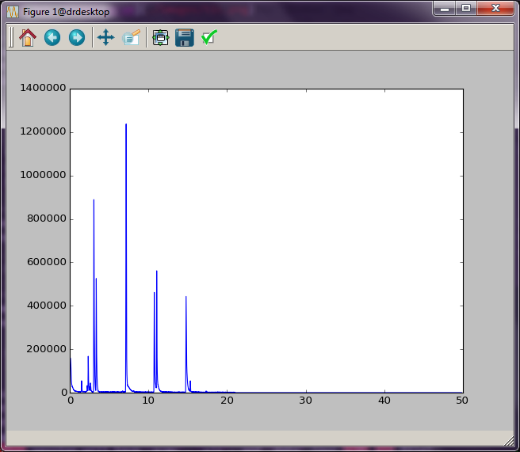

GCMS Filetypes
##############

There are potentially many types of GCMS files; however, all file importing
objects discussed in this section should have identical properties. This is
important for later sections of the documentation, because fitting routines,
etc., usually do not require a specific file type importer. All of the import
objects are constructed with a single string input, which is the name of the
file to process. This file name string can also contain path information if
the file is not located in the current directory. 

AIA Files
=========

`AIA, ANDI, or CDF`_ are all related types of standard GCMS files that are
`derived from`_ the Network Common Data Format (`netCDF`_). They may have
the file extension "AIA" or "CDF". This file type may not be the default for
your instrument, so consult the documentation for your GCMS software to
determine how to export your data in these formats. 

To import this type of data, use the ``AiaFile`` object, which is located in
the ``gcmstools.filetypes`` module.

.. code::

    In : from gcmstools.filetype import AiaFile 

.. note::

    Currently, *gcmstools* can only process CDF version 3 files using
    ``scipy.io.netcdf`` library. Version 4 support could be available upon
    request.

.. _AIA, ANDI, or CDF: http://en.wikipedia.org/wiki/
    Mass_spectrometry_data_format#ANDI-MS_or_netCDF
.. _derived from: https://www.unidata.ucar.edu/support/
    help/MailArchives/netcdf/msg05748.html
.. _netCDF: http://en.wikipedia.org/wiki/NetCDF
  
Read an AIA File
----------------

File readers are imported from the ``gcmstools.filetypes`` module. In this
example, we'll use the AIA file reader, ``AiaFile``; however, the results
should be identical with other readers. To read a file, you can create a new
instance of this object with a filename given as a string. 

.. code::

    In : from gcmstools.filetype import AiaFile

    In : data = AiaFile('datasample1.CDF')
    Building: datasample1.CDF

The variable ``data`` now contains our processed GCMS data set. You can see
its contents using :ref:`tab completion <ipytab>` in IPython.

.. code::

    In: data.<tab>
    data.filename   data.intensity    data.tic    data.masses 
    data.filetype   data.int_extract  data.index  data.times

Most of these attributes are data that describe our dataset. You can inspect
these attributes by typing the name at the IPython prompt.

.. code::

    In : data.times
    Out: 
    array([0.08786667, ..., 49.8351])

    In : data.tic
    Out:
    array([158521., ..., 0.])

    In : data.filetype
    Out: 'AiaFile'

This is a short description of these initial attributes:

* *filename*: String. This is the name of the file that you imported.

* *times*: A 1D Numpy array of the elution time points. 

* *tic*: A 1D Numpy array of the total ion chromatogram (TIC) intensity
  values.

* *masses*: A 1D Numpy array the m/z values for the data collected by the MS.

* *intensity*: This is the 2D Numpy array of raw MS intensity data. The rows
  correspond to the times in the ``times`` array, and the columns correspond
  to the masses in the ``masses`` array. Shape(length of times, length of
  masses) 

* *filetype*: String. This is the type of file importer that was used.

The *index* method is used for finding the indices from an array. Its usage is
explained by example in :doc:`appendB`.

Simple plotting
===============

Now that we've opened a GCMS data set, we can easily visualize these data
using the plotting package Matplotlib. As an example, let's try plotting the
total ion chromatogram. In this case, ``data.times`` will be our "x-axis"
data, and ``data.tic`` will be our "y-axis" data.

.. code:: 

    In : import matplotlib.pyplot as plt

    In : plt.plot(data.times, data.tic)
    Out :
    [<matplotlib.lines.Line2D at 0x7f34>]

    In: plt.show()

This produces a interactive plot window shown in :num:`Figure #ticplot`.
(This should happen fairly quickly. However, sometimes the plot window appears
behind the other windows, which makes it seem like things are stuck. Be sure
to scroll through your windows to find it.) The buttons at the top of the
window give you some interactive control of the plot. See the `Matplotlib
documentation`_ for more information.

.. _ticplot:

    
    Total ion chromatogram.

One drawback here is that you have to type these commands every time you want
to see this plot. Alternatively, you can put all of these commands into a text
file and run it with Python directly. Copy the following code into a plain
text file called "tic\_plot.py". (See :ref:`textfiles` for more information on
making Python program files.) Note: It is common practice to do all imports at
the top of a Python program. That way it is clear exactly what code is being
brought into play. 

.. code::

    import matplotlib.pyplot as plt
    from gcmstools.filetypes import AiaFile

    data = AiaFile('datasample1.CDF')
    plt.plot(data.times, data.tic)
    plt.show()

Run this new file using the ``python`` command from the terminal. The plot
window will appear, and you can interact with the data. However, you will not
be able to work in the terminal again until you close this window. 

.. code:: 

    gcms>$ python tic_plot.py

Alternatively, you can run this program directly from IPython.  This has the
advantage that once the window is closed, you are dropped back into an IPython
session that "remembers" all of the variables and imports from your program
file. See :doc:`Appendix A <appendA>` for more information here.

.. code::

    In : %run tic_plot.py

.. _Matplotlib documentation: http://matplotlib.org/contents.html 

Working with multiple data sets
===============================

In the example above, we opened one dataset into a variable called ``data``.
If you want to manipulate more than one data set, the procedure is the same,
except that you will need to use different variable names for your other data
sets. (Again, using AiaFile importer as an example, but this is not required.)

.. code::

    In : data2 = AiaFile('datasample2.CDF')

These two data sets can be plot together on the same figure by doing the
following:

.. code::

    In : plt.plot(data.times, data.tic)
    Out:
    [<matplotlib.lines.Line2D at 0x7f34>]

    In: plt.plot(data2.times, data2.tic)
    Out:
    [<matplotlib.lines.Line2D at 0x02e3>]

    In: plt.show()

The window shown in :num:`Figure #twotic` should now appear. (There is a blue
and green line here that are a little hard to see in this picture.  Zoom in on
the plot to see the differences.)

.. _twotic:

.. figure:: ./images/tic2.png
    :width: 3.5in
    
    Two TIC plotted together.

