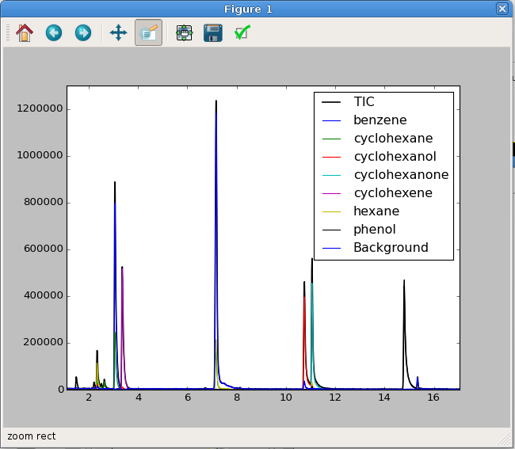

Reference and Fitting
#####################

Non-negative Least Squares
--------------------------

Collecting References for NNLS
++++++++++++++++++++++++++++++

A series of reference spectra are required if you want to do non-negative
least squares (NNLS) fitting. There are two example reference files in this
repository: "ref_spec.txt" and "ref_spec2.MSL". The MSL file is a type of MS
library that can be exported by programs like the AMDIS or the NIST Mass
Spectral Database. The format of both of these files is very important. MSL
files are typically autogenerated by external software and may not need manual
modification. The .txt file was hand generated; more information on this file
format is provided in the next paragraph.  A common feature of both formats,
though, is that comment lines can be included by starting a line with ``#``.
This can be useful if you want to add some notes or to remove reference
spectra without deleting them entirely.

Hand generated ".txt" reference files are made up of a series of reference
compound information separated by blank lines. Information about the reference
compounds are included using labels, and each compound must have two labels at
the minimum : "NAME" and "NUM PEAK". "NAME" will be the reference name
(probably want this to be concise), and "NUM PEAKS" is followed by (at least)
two space-separated columns of MS data. The first column are m/z values, and
the second column are the associated intensity information. Intensities are
normalized on import, so it is not necessary to do this by hand. Other labels
can also be included if you would like to incorporate extra metadata about the
reference compound.  Each reference compound *must* be separated by a blank
line. Below is a small sample of one of these files: 

.. parsed-literal::

    NAME:octane
    FROM:www.massbank.jp
    ID_NUM: JP004695
    NUM PEAKS:
      42 14.07 141
      43 99.99 999
      44 2.54 25
      45 4.03 40
      53 1.58 16
      55 19.83 198
      .
      .
      .

The online MS repository `massBank`_ is a useful place to find these mass and
intensity values. The data from that site is already formated correctly for
this file type.

.. _massBank: http://www.massbank.jp/?lang=en

Loading Reference Spectra
+++++++++++++++++++++++++

There are two objects located in ``gcmstools.reference`` for loading reference
data, ``TxtReference`` and ``MslReferece``, which are used for ".txt" and
".MSL" reference files, respecively. In this example, we'll use
``TxtReferece``, but the other object behaves in the same manner.

First, we'll need some data, and we'll use an ``AiaFile`` object for this
example. 

.. code::

    In: from gcmstools.filetypes import AiaFile

    In: data = gcms.AIAFile('datasample1.CDF')
    Building: datasample1.CDF

Next, import the reference object and create an active instance, which
requires that the name of the reference file is passed into the constructor.
In this example, we have a reference file called "ref\_specs.txt".

.. code::

    In : from gcmstools.reference import TxtReference

    In : ref = TxtReference('ref_specs.txt')

    In : ref.<tab>
    ref.bkg             ref.ref_build       ref.ref_file        ref.ref_meta
    ref.bkg_time        ref.ref_cpds        ref.ref_mass_inten  ref.ref_type

As you can see, several attributes have been created for this new instance. In
most cases, you will not need to work with any of these yourself. To add this
reference information to a GCMS data set, call the reference instance with a
GCMS file object or list of objects to process several files simultaneously.

.. code::

    In : ref(data)
    Referencing: datasample1.CDF

    In : ref([data, otherdata1, otherdata2]) # If these other data sets exist.
    Referencing: datasample1.CDF
    Referencing: otherdata1.CDF
    Referencing: otherdata2.CDF

    In : data.<tab>
    data.filename     data.index        data.masses       data.ref_meta     data.times
    data.filetype     data.int_extract  data.ref_array    data.ref_type     data.tic
    data.intensity    data.ref_cpds               

Several new attributes have been added to our GCMS data object. Here is a
short description of each.

* *ref_cpds*: A list of reference compound names.

* *ref_array*: A 2D Numpy array of the reference mass spectra. Shape( # of ref
  compounds, # of masses)

* *ref_meta*: Associated meta data for each reference compound.

* *ref_type*: The name of the reference object type that was used to generate
  this information. (In this example, this would be "TxtReference".)

Fitting the data
++++++++++++++++

A ``Nnls`` fitting object is provided in ``gcmstools.fitting`` for performing
the non-negative least squares fit. To apply this fitting to a data set,
simply call the fitting instance with a data object or list of objects.

.. code::

    In : from gcmstools.fitting import Nnls

    In : fit = Nnls()

    In : fit(data)
    Fitting: datasample1.CDF

    In : fit([data, otherdata1, otherdata2]) # If these other data sets exist.
    Fitting: datasample1.CDF
    Fitting: otherdata1.CDF
    Fitting: otherdata2.CDF

    In : data.<tab>
    data.filename     data.tic          data.int_sim      data.ref_cpds     
    data.filetype     data.index        data.intensity    data.ref_meta
    data.fits         data.int_cum      data.masses       data.ref_type
    data.fittype      data.int_extract  data.ref_array    data.times

Again, several new attributes describing the fit have been added to our data
set.

* *fittype*: A string that names the fitting object used to generate this
  data. (In this case, it would be "Nnls".)

* *fits*: These are the raw fitting numbers from the NNLS routine. They do not
  correspond to proper integrations, so they should be used with caution.

* *int_sim*: This is a 2D numpy array of simulated GCMS curves that were
  generated from the fit. Shape(# of time points, # of reference compounds)

* *int_cum*: This is a cumulative summation of *int_sim*, so it has the same
  shape as that array. The difference between any two points in this array can
  be used to determine the integral over that region. 

Plotting the Fit
++++++++++++++++

You can do a quick check of how the data looks using Matplotlib. More advanced
examples are presented in :doc:`appendB`. The output of the commands below is
shown in :num:`Figure #fitcheck`.

.. code::

    In : import matplotlib.pyplot as plt

    In : plt.plot(data.times, data.tic, 'k-', lw=1.5)
    Out: [<matplotlib.lines.Line2D at 0x7f9b2905df60>]

    In : plt.plot(data.times, data.int_sim)
    Out:
    [<matplotlib.lines.Line2D at 0x7f9b2f0df160>,
     <matplotlib.lines.Line2D at 0x7f9b29063ac8>,
     <matplotlib.lines.Line2D at 0x7f9b29063d30>,
     <matplotlib.lines.Line2D at 0x7f9b29063f98>,
     <matplotlib.lines.Line2D at 0x7f9b28fef240>,
     <matplotlib.lines.Line2D at 0x7f9b28fef4a8>,
     <matplotlib.lines.Line2D at 0x7f9b28fef710>,
     <matplotlib.lines.Line2D at 0x7f9b28faf720>]

    In : plt.legend(["TIC",] + data.ref_cpds) # This isn't necessary
    Out: <matplotlib.legend.Legend at 0x7f9b25a35438>

    In : plt.show()

.. _fitcheck:

    
    An interactive check of our fit. This has been zoomed in a little to
    highlight the fit and data.

    
